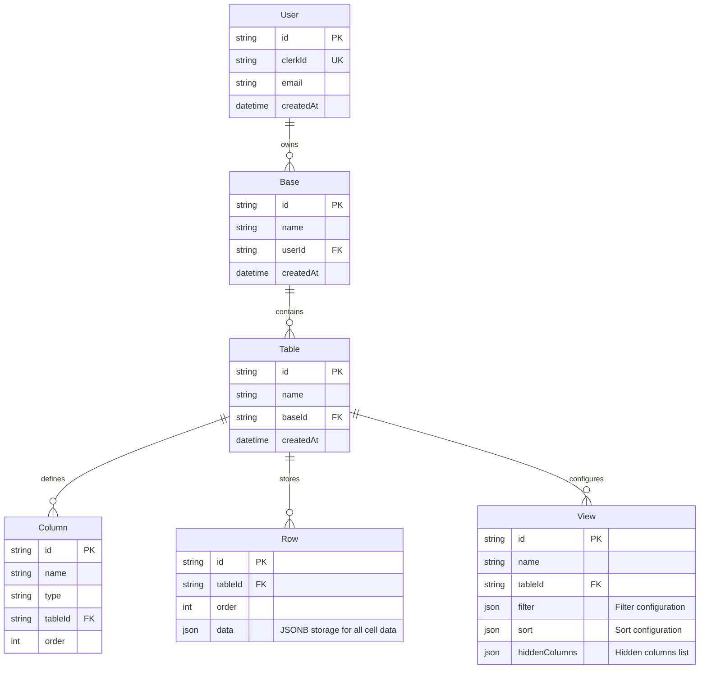

# Airtable Clone

A high-performance Airtable clone using JSONB storage for scalable data management.

## 🏗️ Tech Stack

### Frontend
- **Next.js 15** - React 19 + App Router
- **TanStack Table** - High-performance table component
- **TanStack Virtual** - Virtualized infinite scrolling
- **Tailwind CSS** - Styling system

### Backend  
- **tRPC** - End-to-end type safety
- **Prisma ORM** - Database operations with JSONB support
- **PostgreSQL** - JSONB data storage
- **Clerk** - Google OAuth authentication

### Development
- **TypeScript** - Full-stack type safety
- **Faker.js** - Test data generation

## 📊 Database Schema (ERD)

## 🎯 Project Roadmap

### ✅ Core Infrastructure (Completed)
- **Database Design**: Prisma schema with JSONB optimization
- **Authentication**: Google OAuth via Clerk
- **API Architecture**: tRPC routes for all entities
- **Base Management**: Create/delete workspaces
- **Basic UI**: Homepage with navigation and sidebar

### 🚧 Table Management (In Progress)
- **✅ Basic CRUD**: Create tables with default columns
- **❌ TanStack Table Integration**: Professional table UI component
- **❌ Dynamic Columns**: Add text/number columns on the fly
- **❌ Cell Editing**: Smooth editing with Tab navigation
- **❌ Default Data**: Tables created with faker.js sample data

### ❌ High Performance Features (Not Started)
- **Virtualized Scrolling**: TanStack virtualizer for 1M+ rows
- **Infinite Scroll**: TRPC-powered lazy loading
- **100k Row Generation**: One-click massive data creation
- **Performance Optimization**: Sub-100ms query response times
- **Memory Management**: Efficient virtualization

### ❌ Search & Filter System (Not Started)
- **Cross-Cell Search**: Search across all table data
- **Database-Level Filtering**: PostgreSQL JSONB queries
- **Advanced Filters**: 
  - Text: contains, not contains, equals, empty/not empty
  - Number: greater than, less than
- **Column Sorting**: A→Z, Z→A, ascending/descending
- **Real-time Updates**: Instant search results

### ❌ Views System (Not Started)
- **Save Views**: Persist filter/sort/column configurations  
- **View Management**: Create, update, delete custom views
- **Column Visibility**: Hide/show columns per view
- **View Switching**: Toggle between saved configurations

### ❌ UI/UX Polish (Not Started)
- **Loading States**: Smooth loading indicators
- **Error Handling**: User-friendly error messages
- **Responsive Design**: Mobile-optimized interface
- **Airtable-like Styling**: Professional appearance

